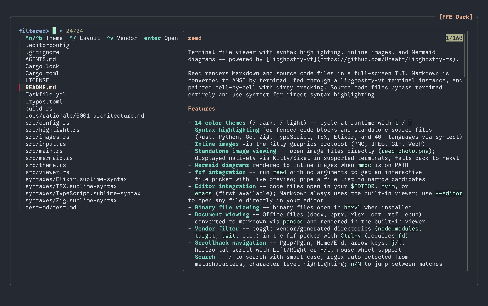

# reed



Terminal file viewer with syntax highlighting, inline images, and Mermaid
diagrams -- powered by [libghostty-vt](https://github.com/Uzaaft/libghostty-rs).

Reed renders Markdown and source code files in a full-screen TUI. Markdown is
converted to ANSI by termimad, fed through a libghostty-vt terminal instance,
and painted cell-by-cell with dirty tracking. Source code files bypass termimad
entirely and use syntect for direct syntax highlighting.

## Features

- **14 color themes** (7 dark, 7 light) -- cycle at runtime with `t` / `T`
- **Syntax highlighting** for fenced code blocks and standalone source files
  (Rust, Python, Go, Zig, TypeScript, TSX, Elixir, and 40+ languages via syntect)
- **Inline images** via the Kitty graphics protocol (PNG, JPEG, GIF, WebP)
- **Standalone image viewing** -- open image files directly (`reed photo.png`);
  displayed natively via Kitty/Sixel in supported terminals, falls back to hexyl
- **Mermaid diagrams** rendered to inline images when `mmdc` is on PATH
- **fzf integration** -- run `reed` with no arguments to get an interactive
  file picker with live preview; pipe a file list to narrow candidates
- **Editor integration** -- code files open in `emacs`, `nvim`, or your
  `$EDITOR` (first available); Markdown always uses the built-in viewer;
  use `--editor` to open any file directly in your editor
- **Binary file viewing** -- binary files open in `hexyl` when installed
- **Document viewing** -- Office files (docx, pptx, xlsx, odt, rtf, epub)
  converted to markdown via `pandoc` and rendered in the built-in viewer
- **Vendor filter** -- toggle vendor/generated directories (`node_modules`,
  `target`, `.git`, etc.) in the fzf picker with `Ctrl-v` (requires `fd`)
- **Scrollback navigation** -- PgUp/PgDn, Home/End, arrow keys, `j`/`k`,
  horizontal scroll with Left/Right or `H`/`L`, mouse wheel support
- **Search** -- `/` to search with smart-case; regex auto-detected from
  metacharacters; character-level highlighting; `n`/`N` to jump between matches
- **Fuzzy heading jump** -- press `s` to search headings via fzf
- **Table of Contents** -- press `Tab` to toggle a sidebar showing all headings
- **Link picker** -- press `l` to list and open URLs via fzf
- **Code block picker** -- press `c` to list code blocks and copy to clipboard
- **Bookmarks** -- `m` + letter to set, `'` + letter to jump
- **Follow/tail mode** -- press `F` to auto-scroll on file changes (like `tail -f`)
- **Export to HTML** -- press `e` to export the current document as a styled HTML file
- **Stdin piping** -- `echo "# Hello" | reed -` reads from stdin
- **Theme persistence** -- saved to `~/.config/reed/preferences.toml`; Ghostty
  gets its own `ghostty_theme` field (defaults to "FFE Dark") so dark-mode
  Ghostty and light-mode terminals coexist
- **Ghostty detection** -- auto-selects "FFE Dark" in Ghostty terminal
- **Pipe-friendly** -- `reed --print FILE` dumps themed output to stdout

## Install

Requires Rust (nightly or stable 1.85+) and **Zig 0.15.x** on PATH (used by
the libghostty-vt build).

```sh
cargo build --release
cp target/release/reed ~/bin/reed
```

On **macOS / Apple Silicon** you must re-sign after copying:

```sh
codesign -f -s - ~/bin/reed    # cp invalidates the ad-hoc signature
```

## Usage

```
reed <file>              # view a file in interactive mode
reed                     # launch fzf file picker with preview
find . -name '*.rs' | reed   # pipe candidates into the picker
echo "# Hello" | reed -  # read from stdin
reed --print <file>      # print themed output to stdout
reed --preview <file>    # fzf preview mode (used internally)
reed --editor <file>     # open directly in $EDITOR / nvim / emacs
reed --theme "Gruvbox" <file>  # override saved theme
reed --line 42 <file>    # start at line 42
```

### Interactive keybindings

| Key | Action |
|-----|--------|
| `q` / `Esc` / `Ctrl-c` | Quit |
| `j` / `Down` / `Scroll down` | Scroll down |
| `k` / `Up` / `Scroll up` | Scroll up |
| `PgDn` / `Space` / `Ctrl-f` | Page down |
| `PgUp` / `Ctrl-b` | Page up |
| `Ctrl-d` / `Ctrl-u` | Half-page down / up |
| `Home` / `g` | Top of file |
| `End` / `G` | Bottom of file |
| `Left` / `Right` / `H` / `L` | Scroll left / right |
| Mouse wheel | Scroll up / down |
| `/` | Search (regex auto-detected) |
| `n` / `N` | Next / previous search match |
| `Tab` | Toggle Table of Contents sidebar |
| `s` | Fuzzy heading jump (fzf) |
| `l` | Link picker (open URL in browser) |
| `c` | Code block picker (copy to clipboard) |
| `m` + `a-z` | Set bookmark at current position |
| `'` + `a-z` | Jump to bookmark |
| `e` | Export to HTML |
| `t` / `T` | Next / previous theme |
| `z` | Toggle zen mode (fullscreen, no chrome) |
| `F` | Toggle follow/tail mode |
| `Ctrl-n` / `Ctrl-p` | Next / previous buffer |
| `?` | Show keybinding help |

### fzf picker keybindings

| Key | Action |
|-----|--------|
| `Enter` | Open file in viewer (or emacs/nvim/`$EDITOR` for code files) |
| `Ctrl-/` | Cycle preview layout |
| `Ctrl-n` | Next theme |
| `Ctrl-b` | Previous theme |
| `Ctrl-v` | Toggle vendor file filter (requires `fd`) |

## Themes

Dark: Default, Gruvbox, Solarized, Ayu, Flexoki, Zoegi, FFE Dark

Light: Default Light, Gruvbox Light, Solarized Light, Ayu Light, Flexoki Light,
Zoegi Light, FFE Light

## Architecture

```
src/
  main.rs       entry point, CLI (clap), fzf picker, tracing init
  viewer.rs     core viewer loop, frame rendering, image/mermaid pipeline
  input.rs      keyboard/scroll event handling, heading picker
  highlight.rs  syntax highlighting (syntect), Zig syntax bundling
  images.rs     Kitty graphics protocol, image loading/resizing
  mermaid.rs    Mermaid diagram detection and rendering via mmdc
  theme.rs      14 themes, skin builder
  config.rs     preferences persistence, Ghostty detection
```

## Development

```sh
cargo build      # compile (requires Zig 0.15.x)
cargo test       # run 134 unit tests
cargo clippy     # lint
cargo fmt        # format
```

On macOS, set the dynamic library path before running from the build directory:

```sh
DYLD_LIBRARY_PATH=$(dirname $(find target/debug/build/libghostty-vt-sys-*/out \
  -name "libghostty-vt*" | head -1)) cargo run -- README.md
```

## License

[MIT](LICENSE) -- Copyright (c) 2026 Pastel Sketchbook
