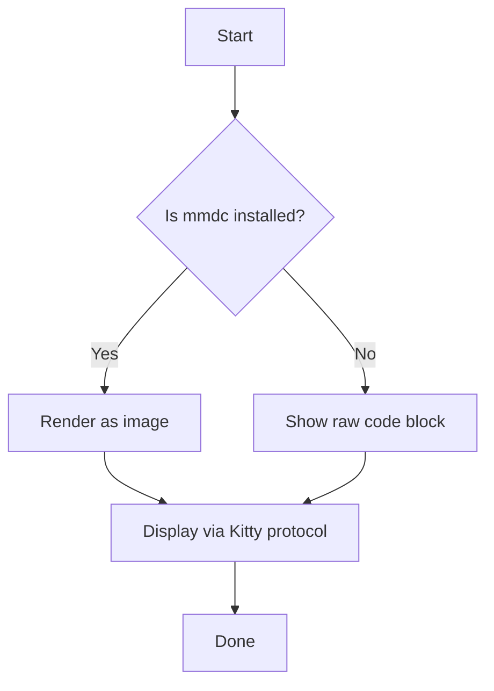
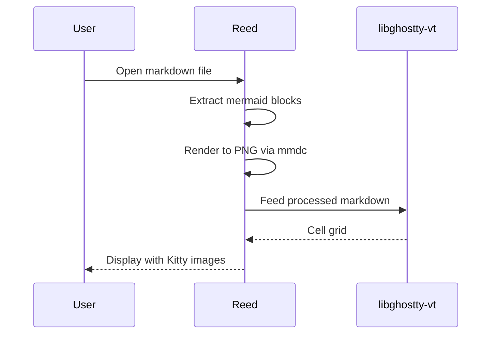

# Reed Test Document

This file tests **mermaid diagrams**, code blocks, and general markdown rendering.

## Flowchart

A simple flowchart rendered via mmdc:



Some text after the flowchart. This paragraph should appear below the rendered diagram.

## Sequence Diagram



## Regular Code Block

This should remain untouched (not treated as mermaid):

```rust
fn main() {
    println!("Hello from reed!");
}
```

## Mixed Content

- Bullet one
- Bullet two
- Bullet three

> A blockquote to test general rendering.

| Feature   | Status    |
|-----------|-----------|
| Images    | Done      |
| Mermaid   | Testing   |
| Scrolling | Done      |

## Final Notes

If everything works, you should see **two rendered diagrams** above (flowchart and sequence diagram) with text flowing normally around them. If mmdc is not found, the mermaid blocks appear as regular fenced code.
